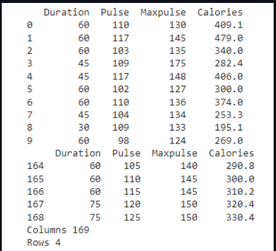

# Read-from-CSV

## AIM:
To write a python program for reading the csv file content.
## ALGORITHM:
Step 1: Import the module pandas.

Step 2: Read the file content using pandas.read_csv().

Step 3: Print the first 10 columns fromn the file.

Step 4: Print the last 5 columns from the file.

Step 5: Count the number of columns and rows using axes[0] and axes([1]) and print .

Step 6: End the Program

## PROGRAM:
```
import pandas as pd
df=pd.read_csv('data.csv')
print(df.head(10))
print(df.tail())
print('Columns',len(df.axes[0]))
print('Rows',len(df.axes[1]))
```
## OUTPUT:

## RESULT:
Thus the program to read the content from csv files has written and verified using python programming.